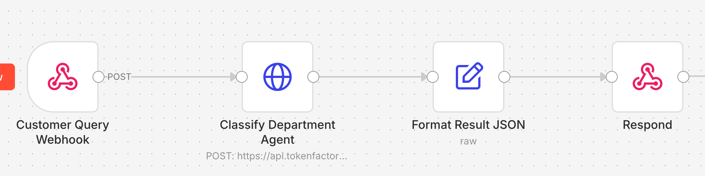

# Customer Support Agent (Starter v1)

An AI customer support system built with **n8n** and **Nebius Token Factory**.

This agent looks at a customer query and routes to the appropriate 'deparment'.

## Features

- Process customer queries (e.g. "I need to reset my password" ) and routes to the appropriate department (biling /sales / support)
- Easy to get started.

## Prerequisites

You will need 

- [N8N account](https://n8n.io/) (free tier is fine)
- [Nebius Token factory](https://tokenfactory.nebius.com/) account (free tier is fine)

## Architecture

## N8N workflow file

Importable workflow file: [customer-support-starter-agent.json](customer-support-starter-agent)

(see next steps to get started)

## Getting Started

[Getting started](getting-started.md)